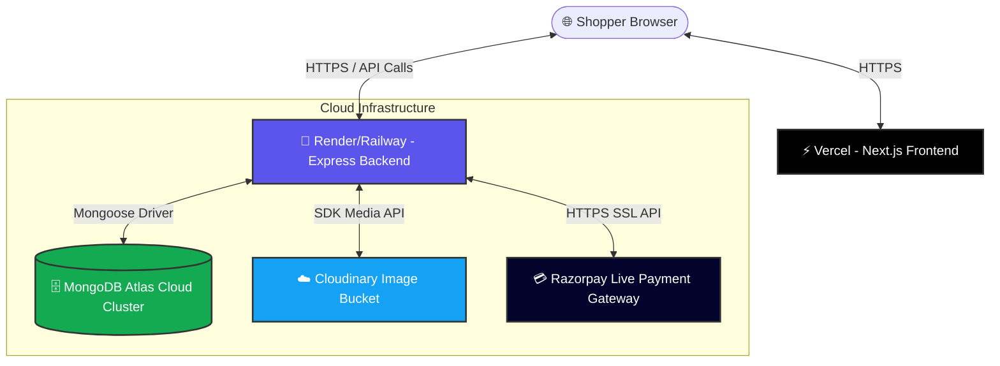

# 🚀 Amore Shop / SweetCrave: Production Deployment Guide

This comprehensive guide walks you through deploying the fully complete, full-stack premium ecommerce application for production. The application is built using Next.js on the frontend, Express on the backend, and leverages MongoDB Atlas, Cloudinary, and Razorpay for cloud infrastructure.

---

## 📐 Production Architecture Overview

The system runs on a modern, decoupled, headless architecture designed for scalability, low-latency, and high security.



---

## 🗄️ Phase 1: MongoDB Atlas Database Setup

MongoDB Atlas hosts your active product catalogs, registered shoppers, and placed orders.

### Step-by-Step Setup:
1. **Create an Account**: Go to [MongoDB Atlas](https://www.mongodb.com/cloud/atlas) and register for a free tier account.
2. **Deploy a Free Cluster**:
   - Choose **Shared Cluster** (M0 Free Tier).
   - Select your preferred cloud provider (AWS/GCP/Azure) and the region closest to your target audience (e.g., *Mumbai (ap-south-1)* for India).
   - Click **Create Cluster**.
3. **Configure Database Security**:
   - Navigate to **Security -> Database Access**.
   - Click **Add New Database User**.
   - Choose **Password Authentication**, set a secure username (e.g. `amore_admin`) and a strong password. Save these credentials.
   - Set user privileges to **Read and Write to Any Database** (or specify `amore_db`).
4. **Configure IP Access Whitelist**:
   - Navigate to **Security -> Network Access**.
   - Click **Add IP Address**.
   - Since Render and Railway use dynamic server IPs, click **Allow Access From Anywhere** (which inserts `0.0.0.0/0`).
   - *Security Note: This is required for public serverless/PAAS hosts. Authentication remains secure via database password hashing.*
5. **Acquire Connection String**:
   - Go to **Database -> Clusters -> Connect**.
   - Select **Connect your application**.
   - Choose **Node.js** as your driver and copy the provided connection URL:
     ```ini
     mongodb+srv://<username>:<password>@cluster0.abcde.mongodb.net/amore_db?retryWrites=true&w=majority
     ```
   - Substitute `<username>` and `<password>` with your database user password credentials.

---

## ☁️ Phase 2: Cloudinary Setup (Image Hosting)

Cloudinary serves as your content delivery network (CDN) for fast, responsive image loading.

1. **Register**: Sign up at [Cloudinary](https://cloudinary.com) for a free developer account.
2. **Retrieve API Parameters**:
   - Open your Cloudinary **Console Dashboard**.
   - Copy the following three values:
     - **Cloud Name** (`CLOUDINARY_CLOUD_NAME`)
     - **API Key** (`CLOUDINARY_API_KEY`)
     - **API Secret** (`CLOUDINARY_API_SECRET`)
3. **Upload Route Endpoint**:
   - Your backend now has a fully complete `/api/upload` endpoint configured. This route supports instant Base64 compression pipelines, letting the Admin Panel upload product photographs directly to your secure Cloudinary bucket.

---

## 💳 Phase 3: Razorpay Payment Gateway Configuration

Your order flows handle **Credit/Debit Cards**, **UPI Google Pay/PhonePe QR Codes**, and **Cash on Delivery (COD)** with advance splits.

1. **Merchant Onboarding**: Register an account on [Razorpay](https://razorpay.com).
2. **Access API Keys**:
   - Go to your Razorpay Dashboard (sidebar).
   - Navigate to **Settings -> API Keys**.
   - Click **Generate Key** (use Test Mode first for verification, then toggle to Live Mode).
   - Save your **Key ID** (`RAZORPAY_KEY_ID`) and **Key Secret** (`RAZORPAY_KEY_SECRET`).
3. **Advanced Splitting Mechanics**:
   - The checkout engine includes built-in business rules for custom bookings. Since premium cakes are custom-baked on-demand, Cash on Delivery orders collect a **30% advance payment** instantly via card/UPI, with the remaining **70% balance** payable in cash or UPI at delivery.

---

## 🚀 Phase 4: Backend Server Deployment (Render or Railway)

Choose either **Render** or **Railway** to host your Express production backend.

### Option A: Hosting on Render (Recommended)
1. Sign up on [Render](https://render.com) and link your GitHub repository.
2. In the dashboard, click **New +** and select **Web Service**.
3. Select your linked GitHub repository.
4. **Configure Server Details**:
   - **Name**: `amore-shop-backend`
   - **Environment**: `Node`
   - **Region**: Select closest to your database (e.g. Singapore/Oregon).
   - **Root Directory**: `backend`
   - **Build Command**: `npm install`
   - **Start Command**: `node server.js`
5. **Environment Variables**:
   Click **Advanced -> Add Environment Variable** and input:
   - `NODE_ENV` = `production`
   - `PORT` = `5000` *(Render binds this automatically to its public router)*
   - `MONGO_URI` = *(Your MongoDB Atlas URL)*
   - `JWT_SECRET` = *(Your cryptographic key)*
   - `FRONTEND_URL` = `https://your-frontend-app.vercel.app` *(Update this after Vercel deployment completes)*
   - `CLOUDINARY_CLOUD_NAME` = *(Your Cloud Name)*
   - `CLOUDINARY_API_KEY` = *(Your API Key)*
   - `CLOUDINARY_API_SECRET` = *(Your API Secret)*
   - `RAZORPAY_KEY_ID` = *(Your Razorpay Key ID)*
   - `RAZORPAY_KEY_SECRET` = *(Your Razorpay Key Secret)*
6. Click **Deploy Web Service**. Once active, copy the public URL (e.g. `https://amore-shop-backend.onrender.com`).

---

### Option B: Hosting on Railway (Alternative)
1. Sign up on [Railway](https://railway.app).
2. Click **New Project** -> **Deploy from GitHub repository**.
3. Select your linked repository.
4. Set the root directory of the service to `/backend`.
5. Under the **Variables** tab of your service, click **New Variable** or use **Bulk Import** to paste your environment variables (from `backend/.env.production.example`).
6. Click **Deploy**. Railway compiles the project and exposes a public domain instantly.

---

## ⚡ Phase 5: Frontend Client Deployment (Vercel)

Vercel is the optimal hosting platform for Next.js 15+ applications.

1. Create a [Vercel](https://vercel.com) account and connect your GitHub profile.
2. Click **Add New...** and choose **Project**.
3. Import your GitHub repository.
4. **Configure Project Overrides**:
   - **Framework Preset**: `Next.js`
   - **Root Directory**: Click Edit, select the `frontend` folder, and click **Continue**.
   - Keep build/output settings as default.
5. **Add Environment Variables**:
   In the Project Settings page, under **Environment Variables**, add:
   - Name: `NEXT_PUBLIC_API_URL`
   - Value: `https://amore-shop-backend.onrender.com/api` *(Your deployed backend URL + /api)*
6. Click **Deploy**. Vercel compiles the pages, checks ESLint rules, minimizes CSS styles, and hosts the website globally on Vercel Edge networks!

---

## 🛠️ Production Troubleshooting & Security Auditing Ledger

Keep this reference handbook handy during deployment to troubleshoot and audit your production stack.

### 1. CORS Blockages (Cross-Origin Resource Sharing)
* **Symptom**: Frontend browser console prints `Access to fetch at... has been blocked by CORS policy: No 'Access-Control-Allow-Origin' header is present.`
* **Solution**: Your backend `FRONTEND_URL` environment variable must exactly match your Vercel public address. Ensure it does NOT contain a trailing slash (e.g. `https://amore.vercel.app` is CORRECT; `https://amore.vercel.app/` is INCORRECT).

### 2. Next.js Routing or 404 Refresh Failures
* **Symptom**: Next.js client pages (like `/checkout` or `/dashboard`) load when navigating from the home screen, but return a 404 or page crash when hard-refreshing.
* **Solution**: Your routing is built on the Next.js App Router which natively supports standard server fallbacks. Ensure you run standard production compilation (`npm run build` as tested) and deploy Next.js with Serverless target on Vercel rather than a raw Static Export (SSG), which allows pages to dynamically render server-side when requested directly.

### 3. Server Startup Loops / Crash (Address Already in Use)
* **Symptom**: Backend crashes on Railway/Render with `EADDRINUSE: address already in use :::5000` or fails health checks.
* **Solution**: Do NOT hardcode `5000` or specify `http://localhost:5000` in server listening loops. Our Express server binds dynamically via `const PORT = process.env.PORT || 5000;`. On cloud PAAS platforms, the hosting platform injects a randomized port into `process.env.PORT`. Express will bind to it and successfully pass health checks.

### 4. Mixed Content Blockages (HTTPS vs HTTP)
* **Symptom**: Browser blocks fetch operations, or checkout pictures fail to resolve, showing security warnings.
* **Solution**: Both Vercel and Render/Railway enforce modern HTTPS SSL certificates by default. Make sure your `NEXT_PUBLIC_API_URL` variable uses the `https://` secure prefix.

### 5. MongoDB Network Access Timeout
* **Symptom**: Backend startup logs freeze at `Connecting to MongoDB at...` and then fail with `MongooseServerSelectionError: connection timed out`.
* **Solution**: Ensure your MongoDB Atlas cluster whitelists IP `0.0.0.0/0` (Network Access). If you forget this step, MongoDB Atlas will reject the incoming connection from your Render or Railway server, and the backend will start in the offline Mock DB Mode instead.
